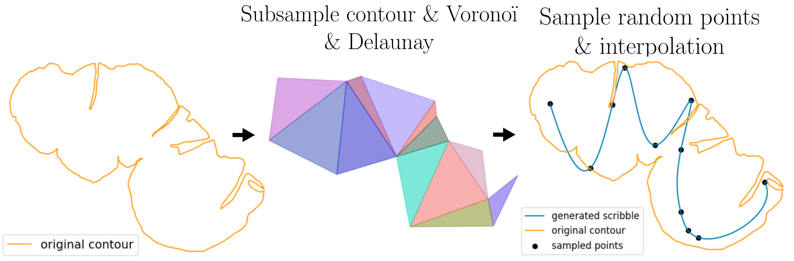
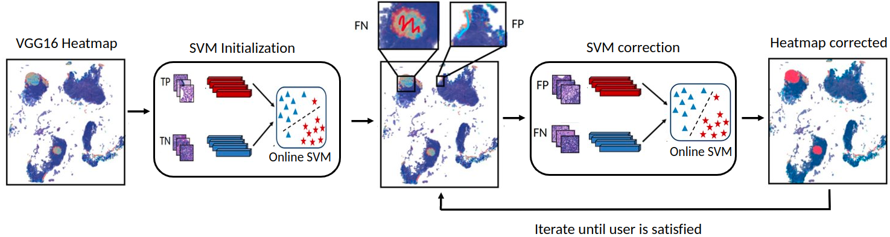

# Weakly-Supervised-Segmentation-and-uncertainty-based-Interactive-Correction-on-Whole-Slide-Images


[](mailto:antoine.habis.tlcm@gmail.com)
[](https://doi.org/10.48550/arXiv.2402.08333)


## 0. Donwload CAMELYON

Download only the tumorous slides of the CAMELYON 16 DATASET.
The CAMELYON dataset was orginally created with only 2 folders: train and test.
For our purpose we will use 3 folder by splitting the original test folder into a test folder and a validation folder.
When the CAMELYON 16 DATASET is downloaded save the annotations and the slides in the directory as described in the config file:

```
path_slide_tumor_train = os.path.join(PATH_CAMELYON, "train/tumor")
path_slide_tumor_test = os.path.join(PATH_CAMELYON, "test/tumor")
path_annotations_train = os.path.join(PATH_CAMELYON, "annotations")
path_annotations_test = os.path.join(PATH_CAMELYON, "test/annotations")
```

## 1. Create Scribbles on each tumorous slide and generate ground truth mask

you can select the percentage of regions you want to scribble with the parameter ```percentage_scribbled_regions = 0.1``` in the config file 
```
cd ./scribble_generation``
python create_dataframe_to_images.py --split train --percentage_scribbled_regions 0.1
```
This code generates healthy and tumorous scribbles for each slides of the CAMELYON 16 DATASET and save the scribbles as a list of coordinates (center of the patches along the scribbles)  with the corresponding slide name and the corresponding class: healthy of tumor
This code must be run on the two split: ```train``` and ```test```

For each split, a dataset is then saved in PATH_CAMELYON

```
python dataframe_to_images.py --split train
```
For each split value , this code extract the images along the scribbles according to the dataframes created before and save them in the 2 folders:
```path_patches_scribbles_train``` and ```path_patches_scribbles_train```.
The class of the patch is written inside the filename of the corresponding patch.



## 2. Train VGG16 or ResNet on Scribbles

```
cd ./train_vgg
python train.py
```

Once the ResNet/VGG16 is trained, the weights are saved in ```path_weights``` and the filename correponding contains the value of ```percentage_scribbled_region```.

## 3. Generate patches/predictions/ground truth values on the original test set

```
cd ./generate_patches_gts_preds
python generate_all_patches.py --k 0 --p 16
```

This code extract the tissue of each slide of the test set and create tiles with an overlap ```ov``` and save them afterwards.
if you have ```num_processors = 16``` and ```n_slides= 48``` then the code must be ran 3 times with ```k = 0, 1, 2```
The patches are saved in ```path_patches_test```.

```
python monte_carlo.py --n_passes <number_mc_passes> --model <model> 
```
model can be either resnet50 or vgg16.
This code uses the VGG16 trained in #2 and monte_carlo to extract for each patch of each slide:

1.   ```n_passes``` predictions.
2.   The feature vector.

the extracted data is save in ```path_prediction_features```


```
python get_gt_patches.py
```

This code generate the ground truth values for each patch and save them to  ```path_prediction_features```.

## 4. generate heatmaps/uncertainty heatmaps


To generate a heatmap/uncerainty map:

```
cd ./heatmaps
python predict_and_create_heatmap_and_uncertainty_map.py --filename test_001 --uncertainty entropy
```

This 2 codes generate a heatmap for a given slide. To select the slide you can change the ```filename``` parameter. If parameter uncertainty is not set this code create a heatmap.
For the uncertainty heatmap you can select one of the 2  uncertainty metric available in uncerainty metrics:(arg = 'entropy or 'std'):

1. ```compute_std```
2. ```compute_entropy```

The code extracts the patch, overlays the prediction on the patch, save the patch in ```patch_predictions_patches``` and stitch all the patches together and save the heatmap in 
```path_uncertainty_maps``` or  ```path_heatmaps```.

## 5. SVM Corrections


```
cd ./correction_SVM
python generate_tables.py --split val --n_tables 10 --use_mc y
```
the code generate the tables in the paper ...
you can either:

1.  use monte-carlo or not for the correction process with the boolean ```use_mc = y/n```.
2.  Select the folder you want to do the correction process on : ```folder = val/test```
3.  Select the epochs range if you want to try different number of epochs for the correction step by changing ```epochs_range```


If you use this code bellow please cite:
```
@misc{habis2024scribblebasedfastweaksupervisioninteractive,
      title={Scribble-based fast weak-supervision and interactive corrections for segmenting whole slide images}, 
      author={Antoine Habis and Roy Rosman Nathanson and Vannary Meas-Yedid and Elsa D. Angelini and Jean-Christophe Olivo-Marin},
      year={2024},
      eprint={2402.08333},
      archivePrefix={arXiv},
      primaryClass={cs.CV},
      url={https://arxiv.org/abs/2402.08333}, 
}
```
